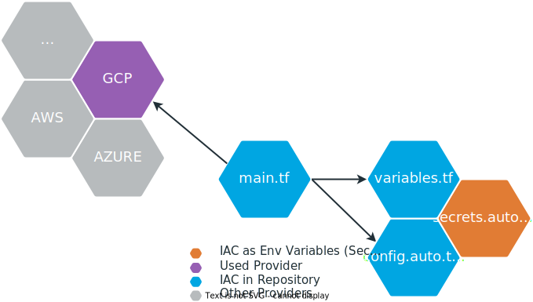

# Survey Survice

## Idea

## Tech Stack

## Architecture

## Automated Infrastructure
As part of the project, we also addressed the issue of infrastructure as code. As a technology we have choosen [Terraform (Automate Infrastructure on Any Cloud)](https://www.terraform.io/), because it is applicable to several cloud providers. For this purpose, a `main.tf` file was created in the backend repository folder `infrastructure`, which describes the provider configuration and the resources in a declarative way. It was possible to automate all except three of the steps for creating the infrastructure. You still have to create a `Google Cloud Project`, enable the `Secret Manager` and enable the `Cloud SQL Admin API` manually. The resources were configured consistently with terraform variables to achieve the highest possible maintainability. Care was taken to ensure that **no** secrets were pushed into the repository. Secret variables can be set by environment variables.

- Provider: Google
- Resources:
  - App Engine
  - Postgres Instance
  - Postgres DB Prod and Dev
  - Postgres DB User
  - Secret Manager
  - Secrets for Postgres and Mongo DB
  - IAM Service Account role assignment

### Terraform Setup

### CLI
Changes to the infrastructure (resource description in `main.tf`) can be analyzed via `terraform plan` (outputs changes that have to be made to reach target infrastructure) and applied via `terraform apply` (changes cloud infrastructure).