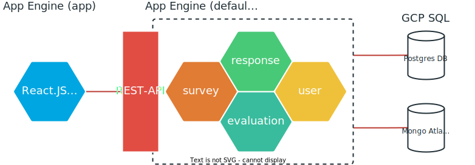

<!---->

# **Survey Service**

Powered by **Julian Jany** and **Michael Neuhold**

---

# About the project
- Prototype for survey platform like Doodle
- Survey represented as JSON Document
- Users can participate
- Survey owner can evaluate results
- Course relevance:
  - Google Cloud Platfrom
  - NoSQL
  - SQL 
  - Scalability & Reliability
  - Infrastructure as Code
  - Costs

---

# Architecture



---

# Tech Stack
- Kotlin
- Maven
- Spring Boot
- Google Cloud Platform
- Postgres
- MongoDB Atlas
- Terraform
---

# Automated Infrastructure
- [Terraform (Automate Infrastructure on Any Cloud)](https://www.terraform.io/)
- Provider: Google
- Resources:
  - App Engine
  - Postgres Instance
  - Postgres DB Prod and Dev
  - Postgres DB User
  - Secret Manager
  - Secrets for Postgres and Mongo DB
  - IAM Service Account role assignment
---


---

# Scalability

## Compute

`App Engine` &rarr; `automatic_scaling` by default.
Configuration parameters that change scaling heuristics:

```Yaml
# app.yaml
# ...

automatic_scaling:
  target_cpu_utilization: 0.65
  min_instances: 5
  max_instances: 100
  min_pending_latency: 30ms
  max_pending_latency: automatic
  max_concurrent_requests: 50
```

---

# Scalability

## Compute

Additional forms of scaling:
- `basic_scaling`
  - `max_instances`
  - `idle_timeout`
- `manual_scaling`
  - `instances`

---

# Scalability

## Persistance

- `MongoDB Atlas` to persist the application data
  - three different subscription plans
- `PostgreSQL`
  - only vertical scaling

---

<style scoped>
table {
  font-size: 20px;
}
</style>

### MongoDB Atlas subscription plans

|   |  Serverless |  Dedicated |  Shared |
|---|---|---|---|
| Usecase | workloads with variable traffic (development & testing) | workloads with consistent traffic (production) | learning & exploring |
| Pricing | consumption based | tier based | tier based (includes free tier) |
| Autoscaling <!-- = 'Elastic scalability' --> | :white_check_mark: compute & storage (seamless) | :white_check_mark: compute & storage (highly configurable) | - |
| Uptime SLA | - | :white_check_mark: 99.995% | - |
| Backups | :white_check_mark: twice per day | :white_check_mark: advanced configuration <!-- Configurable snapshot and retention policies; On-demand snapshots; Point-in-time recovery --> | :white_check_mark: daily (except free tier) |
| Multi-region <!-- advanced data distribution --> | coming later | :white_check_mark: | - |

<!--
The `Shared` plan (free tier) is capable enough for development prototypes and proofs of concept. 
It is not suitable for applications running in production, because of the low memory and throughput constraints. 

The `Serverless` plan is best suited for small businesses or applications with highly varying/volatile workloads, because of the seamless (configuration free) autoscaling and the consuption based pricing. 

The `Dedicated` plan is aimed at larger businesses that have consistently high loads and require additional isolation from other businesses/applications. What really sets this plan apart is the extreme flexibility. 
Some of the additional features:
- Uptime SLA: 99.995%
- manual vertical scaling & horizontal autoscaling
- highly configurable backup
  - configurable snapshot and retention policies
  - on-demand snapshots
  - point-in-time recovery
- multi-region and advanced data distribution (sharding)
-->

---

# Reliability
- App Engine
  - Single region
  - Multiple instances -> multiple zones
- Postgres DB (User Data)
  - Single region
  - Primary and secondary zone for `automatic failover`
- MongoDB Atlas
  - `Shared` Instance (Only for development)
  - In production switch to `Dedicated` deployment
    - elastic scalability
    - multi-region
    - advanced data distribution

---

# NoSQL

- enables horizontal scalability
- enables high fault-tolerance
- drawbacks can largely be mitigated

<!--
`NoSQL` plays an important role in our architecture. 
`NoSQL` enables horizontal scalability and high levels of fault-tolerance for the persistance 'layer' of our project. 
This level of flexibility and scalability through the whole application can only be achieved by utilizing `NoSQL`. 
One of the biggest drawbacks when compared to a relational database - the loss in consistency - can largely be mitigated by design decisions that fit the paradigm. 
As is usual with `NoSQL` databases when designing the `schema` we chose to store redundant information to optimize for higher query performance and throughput.
-->

---

# Replication

- `MongoDB Atlas` & `PostgreSQL` utilize replica sets

- `MongoDB Atlas`:
  - replica set consisting of three nodes
  - backups disabled (free tier)

- `PostgreSQL`:
  - replica set consisting of two nodes &rarr; different zones
  - backups enabled

---

# Costs
[Cost Table](https://docs.google.com/spreadsheets/d/114aw43L75fniRcW9A-0cHi2fMMBBGff7zwSIOP3_CDc/edit?usp=sharing)

---

# Demo Time

- [Backend](https://clc3-survey-demo.oa.r.appspot.com/swagger-ui/index.html)
- [Frontend](https://app-dot-clc3-survey-demo.oa.r.appspot.com/)